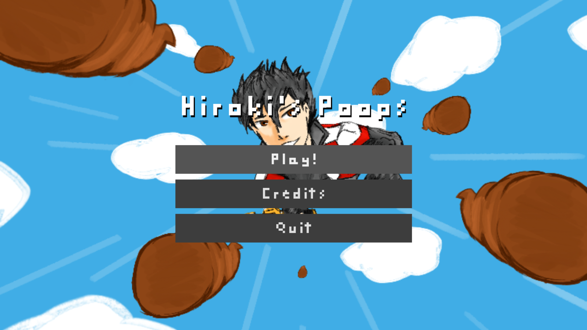
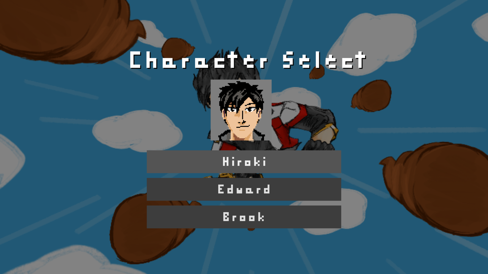
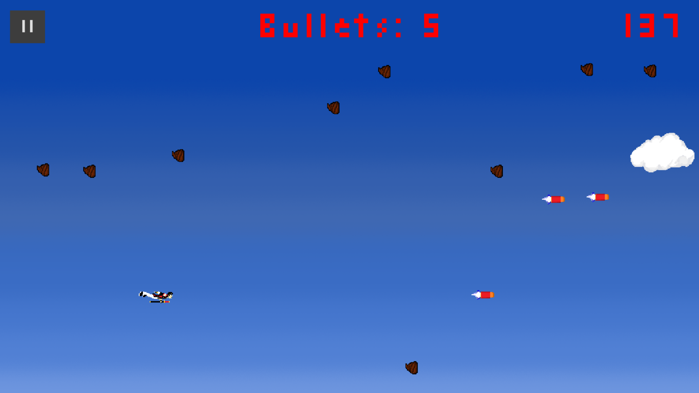

# Hiroki's Poops

Play on [my website!](https://mak448a.github.io/HirokisPoopsGodot)
## NOTICE: Please do not fork this repository. Read the license.

Hiroki's Poops is a game where you fly around the sky and shoot poops.
The game started out as a heavy modification of this [pygame tutorial](https://realpython.com/pygame-a-primer/), but after a few years I ported it over to Godot Engine.
I suggest that you check out the original game and see how much it's been changed!

## Table of contents
1. [How to play](#How-to-play)
2. [Screenshots](#Screenshots)
3. [Downloads](#Downloads)
4. [Credits](#Credits)
5. [Licenses](#Licenses)

## How to play

1. Navigate the menus with the arrow keys
2. Go back a menu with "A" or circle
3. Press "S" or cross to shoot and enter menus
4. Press "P" or start to pause the game
5. Press "F" to enter fullscreen mode
6. Use the arrow keys to move
7. Don't get hit by any poops!

## Screenshots

<details>
<summary>Click to expand</summary>




</details>

## Downloads


## Credits

- Concept: [Real Python](https://realpython.com/pygame-a-primer/)
- Artwork: [RockGold777](https://github.com/RockGold777), Jet, [mak448a](https://github.com/mak448a)
- Joystick: [MarcoFazioRandom](https://github.com/MarcoFazioRandom)
- Voices: Jet, Advisor Ivy, [Chris Pratt](https://en.wikipedia.org/wiki/Chris_Pratt), [Charles Martinet](https://en.wikipedia.org/wiki/Charles_Martinet)
- SFX: Jet, [mak448a](https://github.com/mak448a), [Michael Beck](https://freesound.org/people/yottasounds/sounds/232135/)
- Music: [Keith Green](https://en.wikipedia.org/wiki/Keith_Green), [Koji Kondo](https://en.wikipedia.org/wiki/Koji_Kondo)
- Font: [mak448a](https://github.com/mak448a)

(c) mak448a. All rights reserved.

## Licenses

### Game
```
Copyright (c) 2023 mak448a, All Rights Reserved.
```

### Virtual-Joystick-Godot
[Link](https://github.com/MarcoFazioRandom/Virtual-Joystick-Godot)

```
MIT License

Copyright (c) 2019 Marco F
Copyright (c) 2023 mak448a

Permission is hereby granted, free of charge, to any person obtaining a copy
of this software and associated documentation files (the "Software"), to deal
in the Software without restriction, including without limitation the rights
to use, copy, modify, merge, publish, distribute, sublicense, and/or sell
copies of the Software, and to permit persons to whom the Software is
furnished to do so, subject to the following conditions:

The above copyright notice and this permission notice shall be included in all
copies or substantial portions of the Software.

THE SOFTWARE IS PROVIDED "AS IS", WITHOUT WARRANTY OF ANY KIND, EXPRESS OR
IMPLIED, INCLUDING BUT NOT LIMITED TO THE WARRANTIES OF MERCHANTABILITY,
FITNESS FOR A PARTICULAR PURPOSE AND NONINFRINGEMENT. IN NO EVENT SHALL THE
AUTHORS OR COPYRIGHT HOLDERS BE LIABLE FOR ANY CLAIM, DAMAGES OR OTHER
LIABILITY, WHETHER IN AN ACTION OF CONTRACT, TORT OR OTHERWISE, ARISING FROM,
OUT OF OR IN CONNECTION WITH THE SOFTWARE OR THE USE OR OTHER DEALINGS IN THE
SOFTWARE.
```

### Godot Engine
https://godotengine.org/license/

